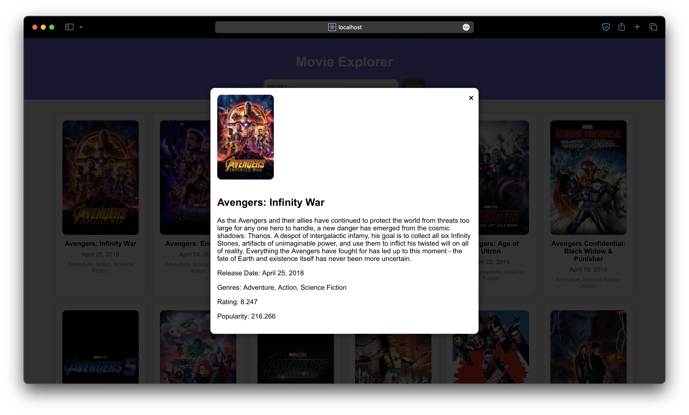

# Movie Explorer

A simple movie explorer app built using ReactJS. It uses the [The Movie Database (TMDb) API](https://www.themoviedb.org/documentation/api) to fetch movies.

## Table of Contents

- [Screenshots](#screenshots)
- [Installation](#installation)
- [Author](#author)

## Screenshots




## Features

- [x] Search for movies
- [x] View movie details
- [x] View similar movies
- [ ] View movie trailers
- [ ] View movie reviews
- [ ] View movie cast
- [ ] View movie crew
- [ ] View movie recommendations

## Installation

```bash
git clone https://github.com/mantreshkhurana/movie-explorer-reactjs
cd movie-explorer-reactjs
# Create a .env file in the root directory and add the following line
# REACT_APP_TMDB_API_KEY=YOUR_TMDB_API
npm install
npm start
```

## Author

- [Mantresh](https://github.com/mantreshkhurana)
